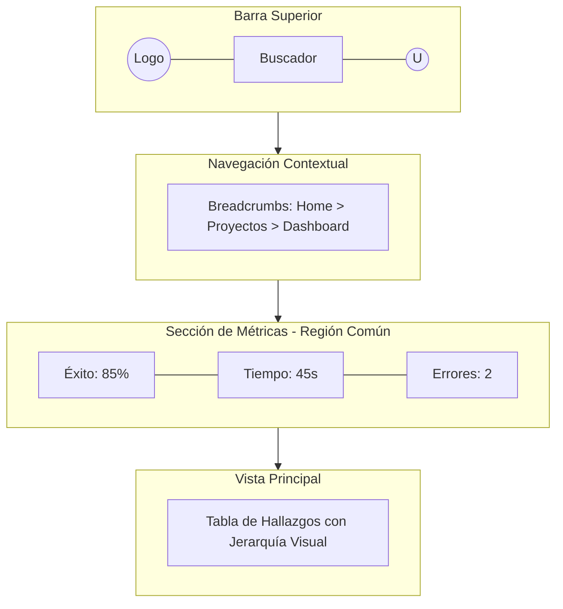

# Rediseño UX - Dashboard 2.0

## 🎨 Principios Aplicados (HCI/UX)

| Principio | Aplicación en el Rediseño | Meta HCI |
| :--- | :--- | :--- |
| **Leyes de Gestalt** | Agrupación de KPIs (Proximidad) y uso de Cards (Región Común). | Menor carga cognitiva. |
| **Jerarquía Visual** | Contraste en KPIs críticos y títulos en negrita. | Escaneo rápido de datos. |
| **Navegación** | Implementación de Breadcrumbs y Steppers. | Ubicación espacial constante. |

---

## 🏗️ Estructura del Dashboard (Mermaid)

> **Nota:** Se ha priorizado el **Escaneo en F** para la disposición de elementos críticos.
